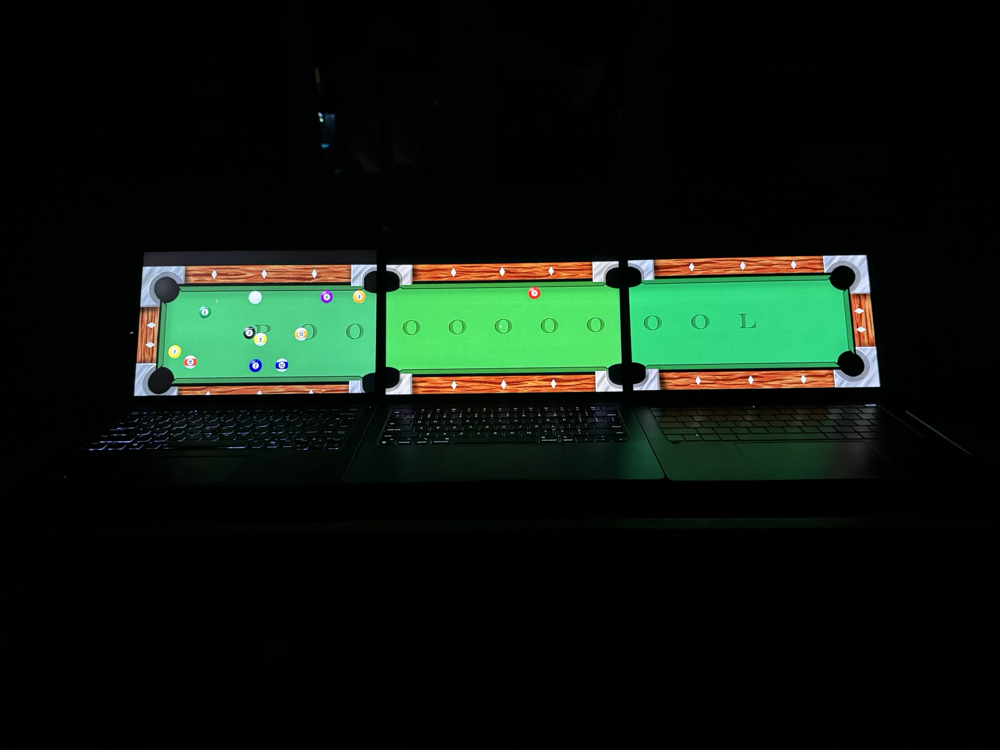

# Pooooooooool

You've heard of pool, but don't you wish the game was longer?
No, it already takes long enough to play. I mean a *truly* longer game of pool.

Demo [link](https://youtu.be/oOVLxR9ZIVk)

Well now you too can third wheel a two player game by providing the third laptop
for a game of Pooooooooool:



## Installation instructions
# Building from source:
```shell
nix-shell # use nix to install dependencies
mkdir build # make a build subdirectory
cd build
cmake ..
make # build the executable
cd ../resource # enter the correct folder so textures and audio can be loaded
../build/pooooooooool # actually run the game
```

## How to Play

1. Open the game
2. To host a game, select the `Host` button. To join a game, enter the host's ip and press `Join`
3. When all players are joined, press `shift` on the host to rack the balls
4. Place the cue ball with the joystick, and hit any button to confirm
5. Use the left stick to aim, and any button to hit the cue ball
5. Take turns attempting to pot your balls. When all your balls are potted, sink the 8 ball to win.
6. Brag to all your friends
7. Donate all your money to us because this is the greatest game ever

## Credits:
- Game design: Oliver Ehlers
- Networking: Ryden Handsaker
- Integration: Andy Sorge
- Art: Karmell Grimm
- Sound: Oliver Ehlers
- Music: Fluffing a Duck by Kevin Macleod
  - Vocals from Ryden & production/recording done by Oliver

## Class:
Lab section 12